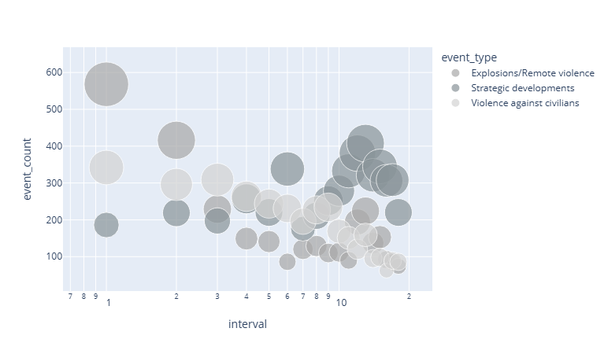

# ME204 Final Project

[use just and index.md if working solo, but if working with others, add links to their invidiual pages like below]

- [Your GitHub username](./your-github-username.md)

**Exploratory analysis of conflict events in Syria after the fall of the Assad Regime**

The sudden end to Bashar al-Assad's 24 year rule in Syria constitued a watershed moment in Syria's political and social climate, and brought an end to the 13 year old civil war. The Assad regime's violent crackdown on pro-democracy forces, sparked by the Arab spring, coupled by the rise of ISIS and the Nusrah Front, which drove millions of Syrians to flee, left the country fragmented and fragile. 

While the transfer of Government powers to Hay'at Tahrir al-Sham (HTS) ended the civil war, years of instability and insecurity has taken a stronghold on the country, which is reeling from the effects of war and oppression, and to this date there are still reports of violence and political tension. 

To gain a deeper understanding of the security situation following the fall of the Assad regime, the present study aims is an exploratory analysis of conflict events within Syria, drawing on data from ACLED from the time of the regime collapse and until today. 

ABOUT THE APPROACH AND METHODOLOGY

The study is exploratory in nature and is not driven by a particular question; instead, it aims to take stock of the type and number of conflict events in Syria after the fall of the Assad regime.

Armed Conflict Location and Event Data (ACLED) is a leading data provider of worldwide conflict data, using media and social media to gather information on individual conflict events. 

The time period used in the study includes the date of the fall of the Assad regime (08 December 2024) and up until July, precisely the date of the last API call. ACLED's data upload schedule for the Middle East is weekly on Mondays. 

This page presents the findings from the analysis. The first segment looks at the different types of conflict events across time, while the second segment delves into three categories of conflict events: strategic developments/non-violent transfer of Government, explosions/remote violence, and violence against civilians. Each of these have unique traits and role within the dataset that help illumnate how the security situation in Syria has evolved since the regime collapse.

**Part 1: The Evolution of Security in Syria: Types of Conflict Events and Frequency 

Since the fall of the Assad regime, and up until July 2026, 16 485 conflict events have been recorded. The bar chart below shows the total count per month ('interval') since the fall of the regime. 

The types of events recorded by ACLED are: 

- Strategic Developments:
- Explosions/Remote violence:
- Violence against civilians:
- Riots:
- Protests:
- Battles:

Out of those, strategic developments, explosions/remote violence, and violence against civilians appear more prominent across the two years. 

***Strategic Developments***

By visualising the timeline of events relating to strategic developments, one can see tha that non-violent transfers of territory were concentrated mainly in the first month following the regime collapse, with one incident in interval 1 and 2, too. However there are 35 counts appearing in interval 13 (Jan-Feb 2026).

<iframe src="./assets/sd_transfer_territory.html" width="100%" height="500" frameborder="0"></iframe>

A further analysis into the actors involved in these events show: 

<iframe src="./assets/bar_sd.html" width="100%" height="500" frameborder="0"></iframe>

<iframe src="./assets/bubble_strat_dev.html" width="100%" height="500" frameborder="0"></iframe>

<iframe src="./assets/line_sd.html" width="100%" height="500" frameborder="0"></iframe>

<iframe src="./assets/sd_transfer_territory.html" width="100%" height="500" frameborder="0"></iframe>

<iframe src="./assets/bar_non-violent_transfer_of_territory.html" width="100%" height="500" frameborder="0"></iframe>

Additionally, an analysis of the location shows that the episodes in interval 13 were concentrated in: ###

***Explosions/Remote Violence***

<iframe src="./assets/bar_erv.html" width="100%" height="500" frameborder="0"></iframe>

<iframe src="./assets/line_erv.html" width="100%" height="500" frameborder="0"></iframe>

***Violence against civilians***

<iframe src="./assets/bar_vac.html" width="100%" height="500" frameborder="0"></iframe>

<iframe src="./assets/line_vac.html" width="100%" height="500" frameborder="0"></iframe>

<iframe src="./assets/bubble_vac_afd.html" width="100%" height="500" frameborder="0"></iframe>

